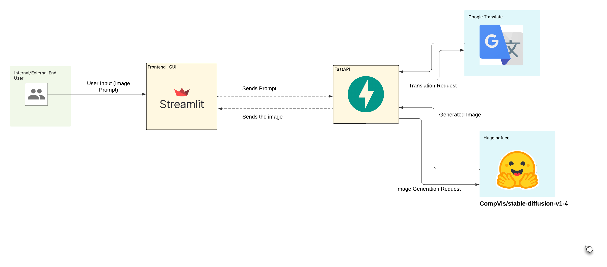
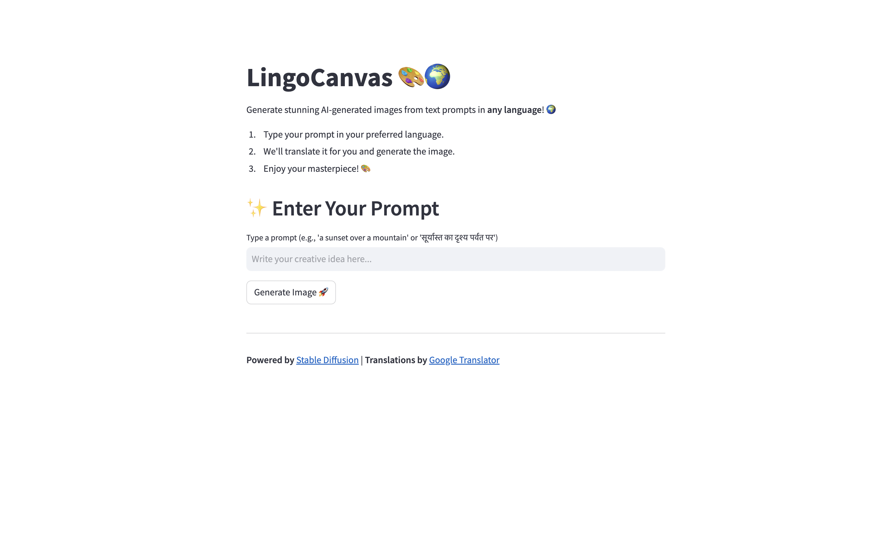
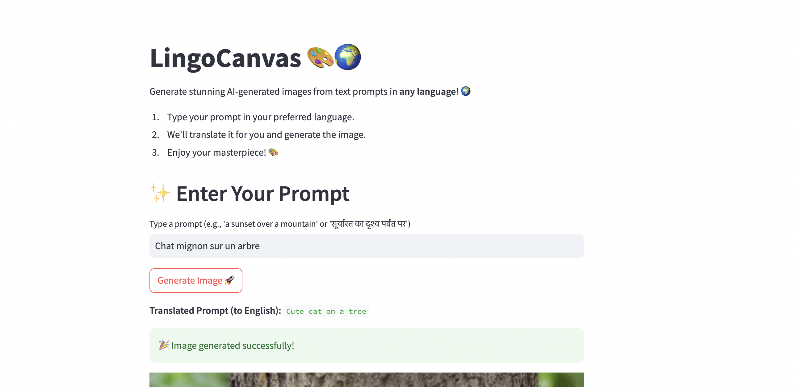

# **LingoCanvas 🎨🌍**  
_A Multilingual AI Image Generator_

## **Project Overview**
**LingoCanvas** is an AI-powered application that transforms text prompts into visually stunning images, allowing users to express their creativity in **any language**. The platform leverages advanced AI models like **Stable Diffusion** for image generation and integrates translation capabilities to support multilingual inputs seamlessly.

Whether you’re a designer, artist, or simply someone with a creative vision, LingoCanvas brings your ideas to life—no matter the language you speak!

---

## **Features**
- **Multilingual Prompt Input**: Type your text prompts in any language, and LingoCanvas will translate it into English for the AI model.
- **AI Image Generation**: Converts translated prompts into high-quality AI-generated images using the Stable Diffusion model.
- **Real-Time Translation**: Integrated with Google Translate for seamless multilingual input processing.
- **Intuitive User Interface**: A simple and user-friendly design powered by Streamlit for a smooth user experience.
- **Downloadable Output**: Users can download their generated images directly from the app.

---

## **How It Works**
1. **Input Prompt**: Users enter a text prompt in any language describing the desired image.
2. **Translation**: The app translates the input prompt to English using Google Translate.
3. **Image Generation**: The translated text is sent to the backend (FastAPI), where the Stable Diffusion model generates the image.
4. **Display & Download**: The generated image is displayed on the app, and users can download it with a single click.



---

## **Tech Stack**
- **Frontend**: [Streamlit](https://streamlit.io) for a responsive and interactive UI.
- **Backend**: [FastAPI](https://fastapi.tiangolo.com) for handling image generation requests.
- **AI Model**: [Stable Diffusion](https://github.com/CompVis/stable-diffusion) for generating high-quality images.
- **Translation**: [Googletrans](https://pypi.org/project/googletrans/) library for multilingual support.

## This is how thw application looks 






## FastAPI Backend


---

## **Installation & Setup**

### **Prerequisites**
Ensure you have the following installed on your system:
- Python 3.8 or higher
- Pip (Python package installer)

### **Steps**
1. **Clone the Repository**
   ```bash
   git clone https://github.com/your-username/lingocanvas.git
   cd lingocanvas
   ```

2. **Install Dependencies**
   ```bash
   pip install -r requirements.txt
   ```

3. **Run the Backend**
   - Start the FastAPI server:
     ```bash
     uvicorn main:app --reload
     ```

4. **Run the Frontend**
   - Start the Streamlit app:
     ```bash
     streamlit run app.py
     ```

5. **Access the Application**
   - Open your browser and go to `http://localhost:8501`.

---

## **Usage**
1. Open the app in your browser.
2. Type a creative prompt in your preferred language (e.g., Hindi, French, or English).
3. Click on **"Generate Image"**.
4. View the AI-generated image on the app.
5. Download the image if you like it!

---

## **Folder Structure**
```
LingoCanvas/
│
├── app.py                   # Streamlit frontend code
├── main.py                  # FastAPI backend code
├── requirements.txt         # Python dependencies
├── README.md                # Project description
└── assets/                  # Static assets (e.g., logos, sample images)
```

---

## **Sample Prompts**
- **English**: "A futuristic cityscape at sunset."
- **Hindi**: "समुद्र किनारे सूरज डूबने का दृश्य।"  
- **French**: "Un château dans une forêt enchantée."  
- **Spanish**: "Un paisaje montañoso cubierto de niebla."

---

## **Future Enhancements**
- Add support for custom model configurations and styles.
- Improve translation accuracy with more robust APIs.
- Allow users to adjust image resolution and quality settings.
- Implement real-time collaborative generation for teams.

---

## **Contributing**
Contributions are welcome! Feel free to fork the repository and submit pull requests for any feature enhancements or bug fixes.

---

## **License**
This project is licensed under the MIT License. See the [LICENSE](LICENSE) file for details.

---

## **Acknowledgments**
- **Stable Diffusion** by CompVis for enabling high-quality AI image generation.
- **Google Translate** for making the platform multilingual.
- The open-source community for providing tools and inspiration.
